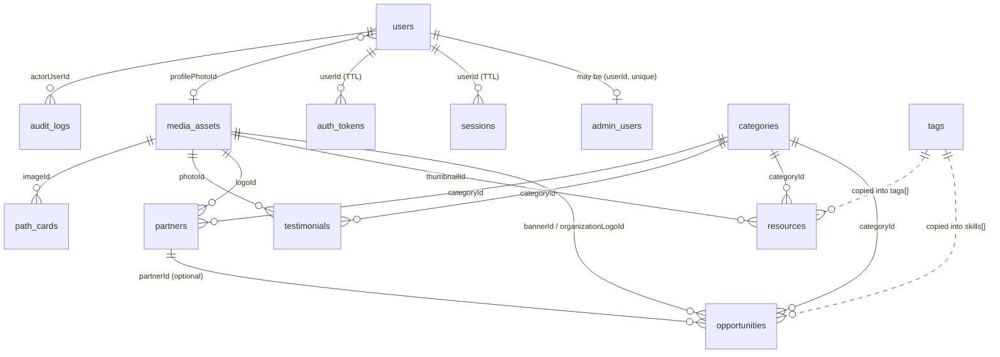

# STUDLYF Main Website Backend — Architecture

Scope: the backend for the **STUDLYF platform**:
- homepage CMS
- public opportunity and resource discovery, with search
- accounts: sign-up, login, verification, reset
- a one-question onboarding
- an admin CMS
- the multi-ecosystem platform (Builder, Founder, Investor, HR, Organizer): profiles, access requests/verification, dashboards, connections, hiring and organizer/evaluation systems (see §8)

Phase 1 shipped the first five items; the ecosystem systems in §8 were built on top of that foundation.

> **Database history:** Phase 1 first shipped on PostgreSQL (Drizzle) and was then migrated to **MongoDB (Mongoose)**. The HTTP API, response shapes and security model did not change, and the same integration tests pass on both. The only client-visible difference is that ids are 24-character hex ObjectIds instead of UUIDs.

---

## 1. Technical decisions

| Concern | Decision | Why |
|---|---|---|
| Runtime | **Node.js 20+ (JavaScript, ESM)** | Same language as the React frontend. |
| HTTP | **Express 5** | Mature and minimal. Rejected async handlers reach the error middleware natively. |
| Database | **MongoDB** (Atlas or self-hosted), via **Mongoose 9** | Schemas and validation at the model layer, declared indexes, and a flexible document shape for CMS blocks. |
| Local/test DB | **Embedded `mongod`** via `mongodb-memory-server` | No MongoDB install needed. It is the real MongoDB server binary, so indexes, TTL and aggregation behave exactly as in production. `embedded:./.data/mongo` persists between dev runs; `embedded:memory` gives each test file a throwaway server. Refused in production. |
| Transactions | **None required** | Data is modelled so that every business operation is a single-document write (§3). The app therefore runs on a standalone `mongod` as well as on replica sets and Atlas. |
| Migrations | `db:migrate` = `syncIndexes()` on every model + ordered data migrations recorded in `_migrations` | MongoDB has no DDL. Indexes are declared in the schemas and synced idempotently; reshaping existing documents is an explicit, run-once script. |
| Validation | **Zod v4** at the HTTP edge, Mongoose schemas at the storage edge | Zod rejects non-string values before they reach a query, so `{ "$gt": "" }` style operator injection is impossible. |
| Auth | **Opaque server-side sessions** (random 256-bit token, SHA-256 hash stored), cookie or `Bearer` | Instantly revocable. Expired sessions are purged by a **TTL index**. |
| Password hashing | **scrypt** (Node built-in), N=2^15 | Memory-hard, with no native build. Hashes are `select: false` on the model. |
| Search | Indexed **`searchTerms` word array** + anchored prefix regexes, with title-weighted ranking in an aggregation | MongoDB `$text` can't prefix-match ("hack" → "hackathon"). Anchored regexes on a multikey index use index bounds. The upgrade path is Atlas Search, behind the same `/search` API. |
| Caching | In-process TTL cache behind a `Cache` interface, plus `Cache-Control` headers | Swap for Redis when scaling out. |
| Media | `media_assets` collection + `StorageDriver` interface | The DB stores key, URL, type, size, dimensions and metadata, never bytes. |
| Email | `Mailer` interface: `console` / `smtp` / `memory` | Links are printed locally and captured in tests. |
| Tests | Vitest + Supertest against an embedded MongoDB | 72 integration tests with no mocked data layer. |

---

## 2. Data model diagram

Solid lines are references (ObjectId fields, resolved with a batched `$in` lookup). **Embedded** data lives inside the parent document.



## 3. Collections

Every document has `_id` (ObjectId), `createdAt` and `updatedAt`.

### Identity
| Collection | Fields | Notes |
|---|---|---|
| `users` | `name`, `email` (unique, lower-cased), `phone`, `passwordHash` (`select:false`), `profilePhotoId`, `primaryRole`, **`roles[]`** `{role, grantedAt, grantedBy}`, `status`, `emailVerified`, `emailVerifiedAt`, `lastLoginAt`, **`onboarding`** `{intent, completedAt}` | The spec's **UserRole** and **OnboardingPreference** models are embedded, because they are always read with the user. This makes sign-up and onboarding single atomic writes. |
| `admin_users` | `userId` (unique), `level` (`SUPER_ADMIN`/`EDITOR`), `active`, `createdBy` | **The only source of truth for admin access.** It is deliberately *not* embedded in `users`, so no user-document update path can grant admin rights. |
| `sessions` | `userId`, `tokenHash` (unique), `expiresAt` (**TTL**), `lastSeenAt`, `revokedAt`, `ip`, `userAgent` | Queries also check `expiresAt > now`, because TTL deletion runs roughly once a minute. |
| `auth_tokens` | `userId`, `purpose`, `tokenHash` (unique), `expiresAt` (**TTL**), `consumedAt` | Single-use. Consumption is one atomic `findOneAndUpdate`. |

### Content
| Collection | Fields | Notes |
|---|---|---|
| `homepage_content` | `sectionKey` (unique), `content` (object), `status`, `publishedAt`, `updatedBy` | The shape of each section is validated by its own Zod schema. |
| `path_cards` | `key` (unique), `title`, `description`, `icon`, `imageId`, `ctaLabel`, `ctaUrl`, `displayOrder`, `status`, `publishedAt` | |
| `opportunities` | `title`, `slug` (unique), `partnerId`, `organizationName`, `organizationLogoId`, `type`, `categoryId`, `shortDescription`, `description` (sanitised HTML), `location`, `mode`, `applicationDeadline`, `startDate`, `endDate`, `externalUrl`, `bannerId`, **`skills[]`** `{name, slug}`, `status`, `featured`, `publishedAt`, `createdBy`, `updatedBy`, `searchTerms[]`, `titleTerms[]` | Skills are embedded copies of `tags` (no join to render or filter). |
| `resources` | `title`, `slug` (unique), `type`, `description`, `thumbnailId`, `categoryId`, `content`, `externalUrl`, `authorName`, `authorUserId`, **`tags[]`** `{name, slug}`, `status`, `featured`, `publishedAt`, `searchTerms[]`, `titleTerms[]` | |
| `platform_stats` | `key` (unique), `label`, `value` (number), `suffix`, `description`, `displayOrder`, `active` | |
| `testimonials` | `personName`, `designation`, `organization`, `quote`, `photoId`, `categoryId`, `featured`, `active`, `displayOrder` | |
| `partners` | `name`, `slug` (unique), `logoId`, `website`, `description`, `categoryId`, `verified`, `featured`, `displayOrder`, `active` | |
| `categories` | `scope`, `name`, `slug`; unique on (`scope`, `slug`) | One taxonomy for every content type. |
| `tags` | `name`, `slug` (unique) | Master vocabulary. Deleting a tag also `$pull`s it from every document that embeds it. |
| `media_assets` | `driver`, `storageKey`, `url`, `mimeType`, `sizeBytes`, `width`, `height`, `purpose`, `originalName`, `altText`, `metadata`, `uploadedBy` | |
| `audit_logs` | `actorUserId`, `action`, `entityType`, `entityId`, `changes`, `ip`, `userAgent`, `requestId` | |
| `_migrations` | `_id` = migration id, `appliedAt` | Migration ledger. |

### Integrity without foreign keys
MongoDB has no FK constraints, so the application enforces referential rules itself:
- **On write:** `categoryId` is checked to exist *in the right scope*. ObjectIds are validated by format.
- **On delete:** deleting a category nulls `categoryId` on every document that uses it; deleting media nulls every image reference; deleting a tag pulls it from embedded arrays.
- **On read:** references are resolved with batched lookups. A dangling id renders as `null`, never as an error.
- **Uniqueness** (email, slugs, keys, token hashes) is enforced by unique indexes. Duplicate-key error `11000` maps to `409`.

### Visibility rules (enforced in queries, never in the frontend)
- Opportunities, resources, path cards and homepage sections are public only when `status = PUBLISHED` and `publishedAt <= now`. This also supports scheduled publishing.
- Stats, testimonials and partners are public only when `active = true`.
- Public serializers are **allow-lists**. `searchTerms`, `titleTerms` and `passwordHash` are excluded at the query level as well.
- The public opportunity `status` filter (`open` / `closed` / `upcoming`) is the date-derived lifecycle, not the publication state.

### Search
- On every create or update, the service rebuilds `searchTerms` from the searchable fields and `titleTerms` from the title:
  - opportunities: title, organisation, short description, location, skills
  - resources: title, description, author, tags, content
- A query like `react dev` becomes `{ searchTerms: { $all: [/^react/, /^dev/] } }`, an index-bounded prefix match.
- Relevance sorting is an aggregation stage that counts matching title words.
- Deadline sorting puts nulls last.

---

## 4. API endpoints (all under `/api/v1`)

Unchanged by the database migration. See [API.md](./API.md).
```
Public   GET /health /home /paths /opportunities[/:slug] /resources[/:slug] /partners /testimonials /stats /categories /search
Auth     POST /auth/register /auth/login /auth/logout /auth/verify-email /auth/resend-verification /auth/forgot-password /auth/reset-password
User     GET|PATCH /me   GET|POST /onboarding
Admin    /admin/{homepage,path-cards,opportunities,resources,stats,testimonials,partners,categories,tags,media,users,audit-logs}
```

---

## 5. Folder structure

```
server/
├── src/
│   ├── app.js                  builds the Express app from injected deps
│   ├── server.js               process entrypoint
│   ├── config/                 env parsing (zod) → typed config
│   ├── database/
│   │   ├── schema/             Mongoose schemas, one file per domain; createModels(connection)
│   │   ├── migrations/         runner (index sync + ledger) and ordered data migrations
│   │   ├── seeds/              development seed data
│   │   ├── client.js           MongoDB / embedded mongod connection
│   │   └── migrate.js, seed.js, create-admin.js   CLI entrypoints
│   ├── common/                 errors, middleware, validation, auth, http, cache, mail, storage, utilities
│   └── modules/
│       ├── auth/  users/  onboarding/
│       ├── homepage/  opportunities/  resources/
│       ├── partners/  testimonials/  stats/  paths/  taxonomy/  media/  search/
│       └── admin/              mounts every module's admin router behind requireAdmin + audit
└── tests/
```
Models are bound to a connection with `createModels(connection)` rather than registered globally. Each test file therefore runs against its own isolated database.

---

## 6. Authentication

- **Register:** validate the input and hash the password with scrypt. Insert **one** user document holding the embedded roles and the onboarding answer. Email a verification token, create a session, and set the cookie. A race with a concurrent sign-up for the same email hits the unique index and returns `EMAIL_TAKEN`.
- **Login:** constant-time handling when the user does not exist. Suspended or deactivated accounts are rejected. The password hash is transparently upgraded if the cost has changed.
- **Session transport:** `studlyf_session` cookie (`HttpOnly`, `SameSite=Lax`, `Secure` in production), or `Authorization: Bearer` for native clients.
- **CSRF:** `SameSite=Lax` + an Origin allow-list on state-changing requests + a strict CORS allow-list.
- **Verification / reset:** hashed single-use tokens with a TTL. `forgot-password` never reveals whether an account exists. A reset revokes every session first, then sets the new password, so if the second write failed the user is merely logged out.
- **Authorisation:** `requireAuth` → `requireAdmin` (an active `admin_users` document) → `requireSuperAdmin` (users and audit logs). Client-supplied roles are never trusted.
- **Rate limits (per IP):** global 300/min; login 10 per 15 min; register 5/h; forgot/resend 5/h.

## 7. How Phase 2+ modules plug in

- **New module:** a folder under `src/modules/<name>`, a schema file registered in `createModels()`, and its routers mounted in `app.js`. Indexes appear on the next `db:migrate`, and existing documents only need a data migration if they must change shape.
- **Builder ecosystem:** `builder_profiles { userId (unique) }`, `projects { ownerId }`, `submissions { opportunityId, projectId }`. Opportunities have stable ids and slugs, and skills use the shared `tags` vocabulary, so matching builders to opportunities is a `skills.slug` query.
- **Startup ecosystem:** `founder_profiles { userId }`, `startups`, `startup_members`.
- **Roles:** `users.roles[]` already holds `BUILDER`/`FOUNDER` from onboarding, indexed on `roles.role`. Future guards (`requireRole('HR')`) read it. `admin_users` stays separate.
- **Organizations:** `partners` is the public face. A private `organizations` collection can reference it with `partnerId`.
- **Applications:** a future `applications` collection references `opportunityId`. The opportunity document is unchanged.
- **STUD OTT / Hub / Roadmaps:** build on `resources` (type + category + tags).
- **Search:** everything goes through `modules/search`. Moving to Atlas Search replaces the repository filters, not the API.

## 8. Multi-ecosystem platform (Builders · Founders · Investors · HR · Organizations)

One account, five ecosystems. The `users` document stays the single identity; each ecosystem keeps its
own profile, created only when the person enters it. No ecosystem ever creates a second account.

```
User ─┬─ BuilderProfile          builder_profiles        self-service (role BUILDER)
      ├─ FounderProfile          founder_profiles        self-service; creating it grants FOUNDER
      │     └─ startup · workspace (market, competitors, SWOT, business model, GTM, marketing, pitch)
      │        · traction · updates[]
      ├─ InvestorProfile         investor_profiles       access request → admin verification
      │     └─ preferences (stages, sectors, geographies, startup types, ticket size) · saved[]
      ├─ HrProfile               hr_profiles             access request → admin verification
      │     └─ HrCandidate       hr_candidates           private pipeline: SHORTLISTED → INVITED → INTERVIEW → OFFER → HIRED
      └─ OrganizationMember ──── Organization            organization verification
            role OWNER/ADMIN/ORGANIZER/EVALUATOR/VIEWER     └─ opportunities (organizationId) · participants
                                                              · submissions · evaluations · rankings · certificates
InvestorConnection  investor_connections  investor ↔ founder, consent-based (PENDING/ACCEPTED/DECLINED/WITHDRAWN)
```

**Access states.** Controlled ecosystems carry `status ∈ PENDING | ACTIVE | REJECTED | SUSPENDED`. Only ACTIVE
unlocks the ecosystem; ACTIVE grants the matching role in `users.roles[]`, any other state removes it.
Admin decisions: `POST /admin/access-requests/:ecosystem/:id/status` (SUPER_ADMIN; a note is required to
reject or suspend; every change is audited and notifies the applicant).

**Resolver (server).** `modules/ecosystems/ecosystems.service.js → ecosystemStates(db, userId)` computes, for
every ecosystem, `{ status: NONE|ONBOARDING|PENDING|ACTIVE|REJECTED|SUSPENDED, active, destination, statusNote }`.
It is embedded in `GET /me` (and `GET /me/ecosystems`). The frontend's `resolveDestination()` only chooses
between these states (intended ecosystem from `?role=` → single ecosystem → selector); a `?role=` value is a
hint about the entry point, never an authorization.

**RBAC.** `requireEcosystem(db, key)` re-reads access from the database on every request and 403s with a
state-specific message (`…still being verified`, `…suspended`). Organization routes additionally check the
member's organization role (`managePrograms`: OWNER/ADMIN/ORGANIZER, `manageMembers`: OWNER/ADMIN).
Only verified organizations (and STUDLYF admins) can create opportunities — builders get 403.

**Sign-up intents.** `ONBOARDING_INTENTS` now include INVESTOR/HR/ORGANIZER; choosing them only records where
the person was heading — the role is never granted by an intent.

**Reserved builder usernames.** Product pages share the `/builders/` prefix with public profiles, so
`dashboard, profile, projects, opportunities, applications, achievements, onboarding, …` are reserved.
